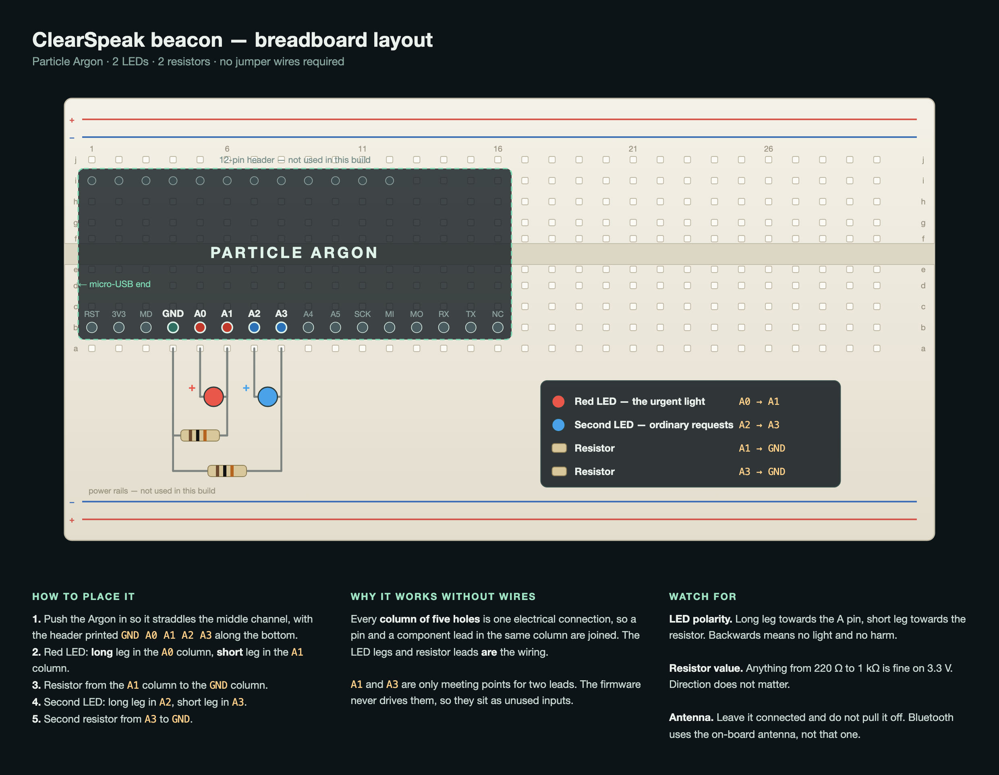

# Version 4 — the caregiver beacon

Version 3 gives someone a voice. Version 4 gives that voice reach.

A screen only talks to whoever is already looking at it, and arranging for somebody to be
looking at you is the exact thing this system's user cannot do. When the board says
**"I need help"**, a light starts flashing on a small board that the carer can keep in
whatever room they are actually in.



---

## What you need, and what you can skip

| Part | Needed? |
| --- | --- |
| Particle Argon | Yes |
| Micro-USB cable | Yes — for power and for flashing |
| 1 LED, 1 resistor, breadboard | Optional. Improves the demo |
| A 2nd LED and resistor | Optional again. Easier to read, no code change |
| Wi-Fi antenna | No. Leave it plugged in and do not touch it |
| Jumper wires | Not needed |

**The Argon's own RGB LED is software-controlled and already does the job.** Flash the
firmware, plug in USB, and the board glows green when idle and flashes red on an urgent
message. If you are short on time, stop there — everything below is an upgrade, not a
requirement.

---

## 1. Flash the Argon (Windows)

The Argon never joins Wi-Fi in this build, so campus Wi-Fi being locked down does not
matter. Only your laptop needs internet, and only to compile.

```powershell
npm install -g particle-cli
particle login
```

Put the Argon into DFU mode: hold **MODE**, tap **RESET**, keep holding MODE until the
status LED blinks **yellow**, then let go.

```powershell
particle compile argon firmware --target 4.2.0 --saveTo beacon.bin
particle flash --usb beacon.bin
```

The status LED should settle into a slow green breath. That means the firmware is running
and the beacon is idle. On macOS the commands are identical.

If the CLI fights you, [build.particle.io](https://build.particle.io) will compile and
flash the same file from a browser.

## 2. Check it before you wire anything

Open any serial monitor on the Argon's port at 9600 baud and send a single character:

- `2` — urgent. Red, fast, alternating.
- `1` — request. Blue, one slow pulse.
- `0` — clear.

If the onboard LED responds, the firmware is good and anything that goes wrong later is
wiring or Bluetooth, not this.

## 3. Wire the two LEDs

Follow the picture. In words:

1. Push the Argon into the breadboard so it **straddles the centre channel**, with the
   header carrying `GND A0 A1 A2 A3` along the near side.
2. Red LED: **long** leg into the `A0` column, **short** leg into the `A1` column.
3. A resistor from the `A1` column across to the `GND` column.
4. Second LED: long leg into `A2`, short leg into `A3`.
5. The other resistor from `A3` across to `GND`.

Each **column of five holes is one electrical connection**, so a pin and a component lead
in the same column are joined. That is why this needs no jumper wires — the LED legs and
resistor leads *are* the wiring. Where two leads share a column, put them in any two holes
of that column.

`A1` and `A3` are only meeting points, and the choice is arbitrary — **any unused analog
column works**, so if your LED's short leg landed in `A4` instead, that is fine and needs
no code change. The firmware never configures or writes a junction pin, so it sits as an
unused input at about 1.3 V, well inside the safe range. Only the column the LED's *long*
leg goes into has to be `A0`.

Any resistor between **220 Ω and 1 kΩ** works on 3.3 V. Lower is brighter. Resistors have
no direction; LEDs do, and a backwards LED simply does not light.

## 4. Pair it with the board

Run the web app, then use **caregiver beacon** in the right-hand panel.

- **Pair over Bluetooth** — the honest version. The Argon can be across the room.
- **USB** — the reliable version. An expo hall is a hostile 2.4 GHz environment and a
  cable does not care.

**Use Chrome or Edge.** Safari implements neither Web Bluetooth nor Web Serial, so on a
Mac the beacon will not appear at all in Safari. On macOS you must also allow Bluetooth
for Chrome under System Settings → Privacy & Security → Bluetooth. On Windows 10 or 11 it
works in Chrome and Edge with no setup.

## What triggers what

| On the board | Beacon |
| --- | --- |
| **Help**, **Pain** | Fast 2.5 Hz blink, onboard LED red, held 30 s |
| Any other spoken tile | One slow pulse, onboard LED blue, 6 s |
| Nothing for 30 s | Back to the idle green breath |

Rate and rhythm carry the difference, not which bulb is lit, so **one LED on `A0`
shows every alert level**. Fit the second LED on `A2` and the two run out of phase on an
urgent alert and together on a request, which is easier still to read across a room — but
nothing in the firmware changes either way.

A request never cancels an urgent alert. Water can wait; pain cannot, and a beacon that
downgrades itself would be worse than no beacon.

Alerts expire on their own. A light still burning after the moment has passed teaches the
carer to ignore it, which is the failure mode that matters.

## If the demo goes wrong

- **No device in the Bluetooth chooser** — the Argon is not running the firmware, or it is
  already paired to another machine. Tap RESET.
- **Paired but no light** — press **Test the alarm** in the panel. If the onboard RGB
  reacts and the breadboard LEDs do not, it is the wiring, and the demo still works off the
  onboard LED.
- **Everything is dead** — unpair and use **USB**. It is the same firmware over a cable.

The speech board itself does not depend on any of this. With no beacon paired, version 4
behaves exactly like version 3.
